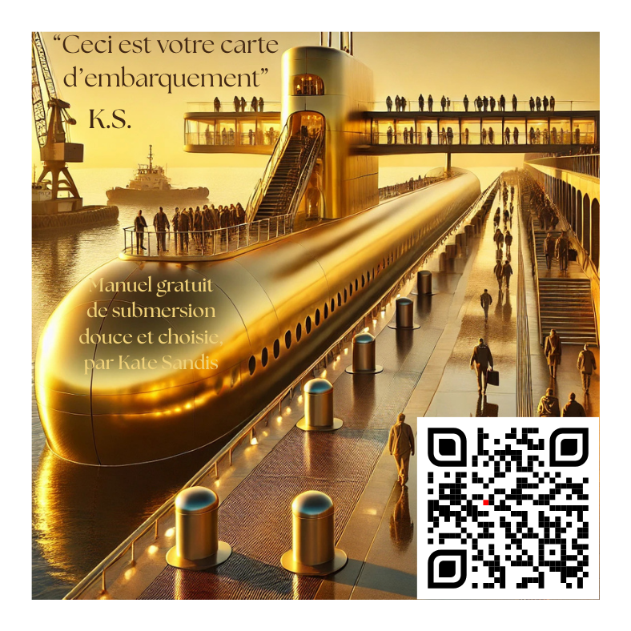

# Kate Sandis — SNLE

✨ **Tous les contenus de ce site sont gratuits et en open source.**  
Ils peuvent être librement téléchargés, partagés et utilisés, dans l’esprit d’un accès ouvert à la pensée et à la création.

> « Ceci n’est pas une publicité. C’est une porte. »

Bienvenue dans l’espace de diffusion du **Système de Neutralisation des Lignes d’Existence**.  
Ici, pas de publicité, pas de suivi : seulement des textes, des couvertures, et des portes ouvertes.

---

## 📑 Accès rapide
- [Biographie](#-biographie-de-kate-sandis)
- [Manifeste](#-manifeste-de-la-trilogie-snle)
- [Tome 1](#-tome-1--observation)
- [Tome 2](#-tome-2--retrait)
- [Tome 3](#-tome-3--incarnation)

---

## 👤 Biographie de Kate Sandis
- [Biographie officielle (PDF)](assets/biographie.pdf)

---

## 📜 Manifeste de la Trilogie SNLE
  
👉 [Télécharger le Manifeste (PDF)](assets/manifeste.pdf)

---

## 📘 Tome 1 — Observation
  
👉 [Télécharger le Tome 1 (PDF)](assets/tome1.pdf)

---

## 📗 Tome 2 — Retrait
  
👉 [Télécharger le Tome 2 (PDF)](assets/tome2.pdf)

---

## 📕 Tome 3 — Incarnation
  
👉 [Télécharger le Tome 3 (PDF)](assets/tome3.pdf)

---

⚠️ **Note :** aucun cookie, aucune collecte de données, aucun suivi.  
Ce site est pensé comme une bibliothèque libre, simple et accessible.
