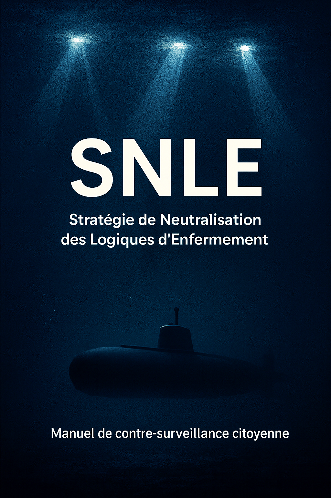
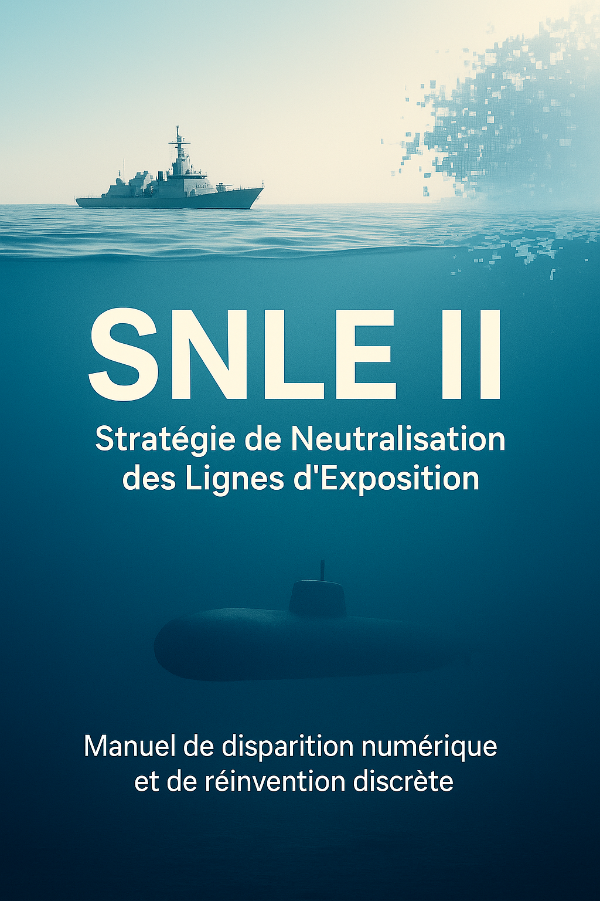
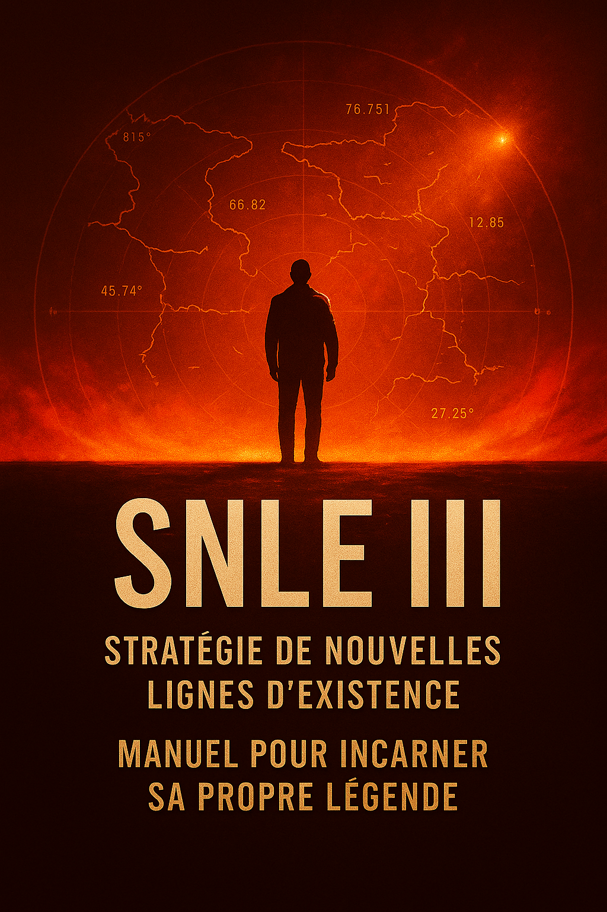

# Trilogie SNLE par Kate Sandis

✨ **Tous les contenus de ce site sont gratuits et en open source.**  
Ils peuvent être librement téléchargés, partagés et utilisés, dans l’esprit d’un accès ouvert à la pensée et à la création.

> « Ceci n'est pas une publicité, c'est un quai d'embarquement! Vous venez de pénétrer un espace citoyen de contre-surveillance, de résistance au contrôle orwellien en marche, dans le cadre de l'état de droit qu'est la France (pour l'instant)! Cet espace accessible vous améne aux abords d'un gigantesque SNLE civil (un sous marin français à la pointe de la technologie) à la disposition du peuple. Vous avez le droit de monter, qui que vous soyez, vraiment! Vous embarquez? K.S. »

« Bienvenue dans l’espace principal -et protégé- de libre diffusion SNLE du **Système de Neutralisation des Logiques d'Enfermement, des lignes d'Exposition et des Lignes d’Existence**. Un manifeste et une trilogie en 3 tomes.  
Ici, pas d'abonnement, pas de publicité, pas de suivi, pas de cookie, pas de tracking, pas d'argent ni de contrepartie ; on s'en fout, c'est pour la sauvegarde de la conscience humaine : seulement des textes écrits, des outils simples et des portes ouvertes à qui choisit de les prendre. un grand merci donc à Github pour cette plateforme. 
Pour que la liberté d'expression redevienne vecteur de lecture, de pensée, de réflexion et de conscience. Pour que l'intelligence humaine procéde à ses propres mises à jour face à la montée des intelligences artificielles, utilisées de plus en plus à mauvais escient, par le biais d'algorithmes toujours plus aiguisés, d'outils de recoupements d'informations dignes des services de renseignements les plus virulents, par des agents administratifs grassement payés pour déclencher la guillotine et punir le premier qui s'approche du seuil d'alerte. 
Vous savez c'est noté de 0 à 1? Savez vous si vous êtes plutôt 0.48 ou 0.67? On est d'accord, personne n'en sait rien! Et de plus on ne sait pas à quel seuil de suspicion la guillotine est déclenchée. Donc j'écris en mon nom, grâce à tous les témoignages que vous m'offrez depuis de nombreuses années. Je recueille et je recherche, je raconte, j'étaye et j'argumente... et pour ça : surtout pas un drapeau, même pas un chapeau... rien d'autre que l'invitation à lire et à se questionner, à agir à son niveau, voire à m'envoyer un mail si le coeur vous en dit. K.S. »

## 📬 Contact
Pour toute question ou échange, vous pouvez écrire à :  
👉 [katesandis@proton.me](mailto:katesandis@proton.me)
Des réponses ne seront pas forcément adressées pour de simples remerciements ou témoignages mais sachez que ceux ci me vont droit au coeur et que je consigne vos coordonnées méticuleusement. Face au grand nombre de messages en ce printemps 2025, notamment face aux pressions de contrôles ciblés de plus en plus prégnants, je me dois de répondre en priorité aux messages les plus activistes et/ou en recherche de coopération. Ceci afin de renforcer l'équipage dont nous aurons besoin très bientôt. Merci de votre compréhension et bon embarquement à chacun(e) d'entre vous. K.S.

---

## 🧭 Outil interactif de diagnostic SNLE
Un outil pratique qui vous guide pas à pas pour utiliser concrétement et de façon personnalisée les textes de la trilogie SNLE comme cadre d’analyse et d'action stratégique. Avec l'assistance de chatgpt5 👉 https://chatgpt.com/

👉 [Télécharger le mode d’emploi (PDF)](assets/outil-snle.pdf)

---

## 📑 Accès rapide
- [Biographie](#-biographie-de-kate-sandis)
- [Manifeste](#-manifeste-de-la-trilogie-snle)
- [Tome 1](#-tome-1--observation)
- [Tome 2](#-tome-2--retrait)
- [Tome 3](#-tome-3--incarnation)

---

## 👤 Biographie de Kate Sandis
- [Biographie officielle (PDF)](assets/biographie.pdf)

---

## 📜 Manifeste de la Trilogie SNLE
  
👉 [Télécharger le Manifeste (PDF)](assets/manifeste.pdf)

---

## 📘 Tome 1 — Observation
  
👉 [Télécharger le Tome 1 (PDF)](assets/tome1.pdf)

---

## 📗 Tome 2 — Retrait
  
👉 [Télécharger le Tome 2 (PDF)](assets/tome2.pdf)

---

## 📕 Tome 3 — Incarnation
  
👉 [Télécharger le Tome 3 (PDF)](assets/tome3.pdf)

---

⚠️ **Note :** aucun cookie, aucune collecte de données, aucun suivi.  
Ce site est pensé comme une bibliothèque libre, simple et accessible. 
